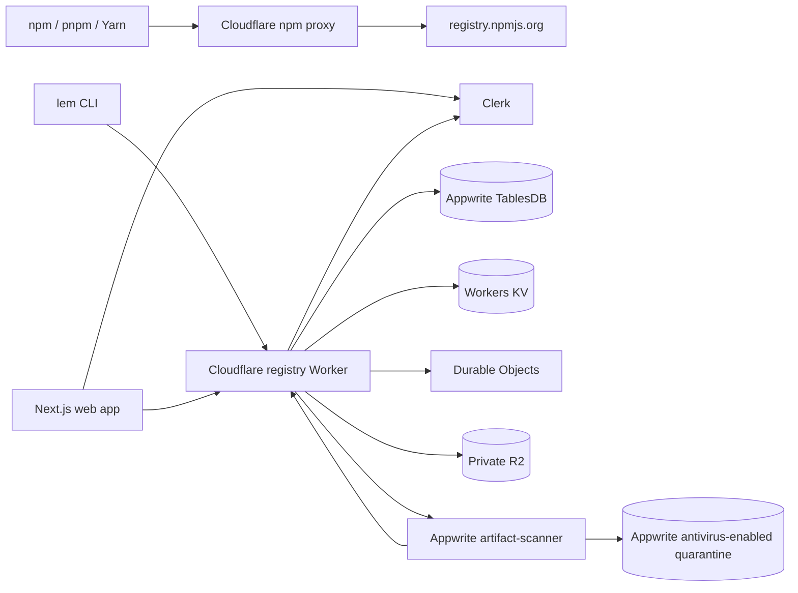

# Lemonize

Lemonize is a public, noncommercial package-distribution beta for JavaScript and TypeScript. The `lem` CLI publishes namespace-scoped Lemonize packages and installs complete dependency graphs from both Lemonize and public npm. A separate read-only npm pull-through proxy is available at `https://npm.lemonize.cyou`.

> Production is intentionally **read-only for cutover**. Public metadata and artifact downloads may remain available, while every package publication and maintenance mutation, including soft-yank, is rejected for publishers and administrators.

## CLI

After a CLI release has been published, users can install the standalone binary without npm or Node:

```bash
curl -fsSL https://registry.lemonize.cyou/install.sh | sh
irm https://registry.lemonize.cyou/install.ps1 | iex
```

Node users may alternatively install `@lemonize/cli`. Typical commands are:

```bash
lem login
lem info @demo/utils
lem add @demo/utils --source lemonize
lem install
```

Publishing requires a Clerk account linked to a verified GitHub identity, acceptance of the current terms, a scoped API token, and a package name in that account's Lemonize namespace:

```bash
lem login
lem init
lem publish # package.json name must be @your-namespace/name
```

The first eligible GitHub sign-in allocates a namespace from the GitHub username. A collision receives a stable GitHub-ID-derived suffix. Once the account owns a package, its namespace is frozen even if the GitHub username or email later changes.

Public npm packages can be installed through Lemonize's CDN endpoint with npm, pnpm, or Yarn. npmjs remains authoritative and the proxy is download-only:

```bash
npm config set registry https://npm.lemonize.cyou/
```

Legacy unscoped packages migrated from the previous registry remain resolvable and downloadable for compatibility. The publish path prevents a new unscoped package or version, and maintenance rejects an unscoped package for non-admin callers. Explicit administrator remediation requires a mutable registry or direct controlled operations; `read_only` blocks the HTTP maintenance routes for admins too.

## Architecture



| Service                       | Responsibility                                                                                                       |
| ----------------------------- | -------------------------------------------------------------------------------------------------------------------- |
| Appwrite TablesDB             | Authoritative users, API-token digests, packages, versions, tags, reservations, scan jobs, quotas, and audit records |
| Private R2                    | Staged/immutable artifacts, conditional quota locks, and versioned CLI release objects                               |
| Workers KV                    | Revocation acceleration and metadata cache; never authoritative                                                      |
| Durable Objects               | Atomic one-time device approvals and globally serialized per-principal fixed-window rate counters                    |
| Appwrite function and Storage | Bounded archive validation, antivirus quarantine, and retained accepted recovery copy                                |
| Clerk                         | Browser identity, active-account status, verified sign-in policy, and GitHub publisher eligibility                   |
| npm proxy Worker              | Read-only npm route allowlist, edge cache, origin admission budgets, and exact upstream tarball passthrough          |

There is no D1 binding or D1 query on the current runtime path. D1-related files that remain in the repository exist only to read and migrate the legacy registry; Cloudflare bootstrap creates KV and R2 resources only.

## Authentication and authorization

`lem login` uses manual device-code approval:

1. The CLI requests a random device secret/display code, opens `/login` without embedding the code in the URL, and polls for up to ten minutes.
2. The user signs in through Clerk and manually types the code shown by their own terminal.
3. The Worker verifies the Clerk JWT against the configured issuer, remote JWKS, expiry, and exact authorized-party origin, then checks the Clerk user is still active.
4. The Worker stores a 120-second approval in a per-code Durable Object. A transaction makes the approval single-use across regions; the successful poll returns a 30-day Lemonize API token.

The CLI-supplied username is never trusted. In `public` mode, an active Clerk account with a linked GitHub external ID becomes a publisher; accounts without GitHub remain consumers. Administrator authority is assigned only by immutable Clerk subject IDs in `ADMIN_CLERK_IDS`. Clerk must require its configured verification and legal-consent flow.

API tokens are opaque `lem_live_` credentials. Only their SHA-256 digests are stored in TablesDB. Supported scopes are `read`, `publish`, `manage:packages`, and `manage:tokens`; publish and management routes enforce their scopes in addition to package ownership and the user's current role. `read` is currently descriptive/reserved because public reads and `/auth/me` do not gate on it. User-created tokens last 1-90 days, can be listed or revoked with `lem token ...`, and are rechecked against Clerk account status with a bounded KV cache.

## Publication safety

Publishing is asynchronous and fail-closed:

Public-beta publishers are limited to five packages, twenty versions per package, two concurrent publishes, 10 MiB per artifact, and 100 MiB published plus reserved bytes. A serialized global reservation gate enforces the configured storage ceiling.

1. A publisher reserves `@namespace/name@version` and uploads to a random private R2 staging key using a short-lived, reservation-bound capability.
2. The Worker records a scan job in TablesDB and invokes the private Appwrite `artifact-scanner` function.
3. Worker and scanner authenticate their protocol with timestamped HMAC-SHA256 signatures.
4. The scanner re-computes SHA-256 and SHA-512, validates gzip/tar structure, paths, entry types, manifest identity and canonical manifest digest, file count, and unpacked size, then writes to an antivirus-enabled Appwrite quarantine bucket.
5. Only a matching signed `clean` result allows the Worker to copy bytes to an immutable content-addressed R2 key and publish metadata. The accepted Appwrite Storage copy is retained as an independent recovery source; rejected and expired copies are removed. Rejected, timed-out, or inconsistent jobs are never public.

The installer independently verifies SHA-512 before extraction, rejects path traversal and link entries, and never runs package lifecycle scripts.

## Repository layout

```text
apps/
  artifact-scanner/  Appwrite Node function for archive validation
  npm-proxy-worker/  Read-only public npm pull-through proxy
  registry-worker/   Cloudflare Worker API and download gateway
  web/               Next.js web app and Clerk device approval
packages/
  cli/               @lemonize/cli: lem and lemx
  package-format/    pack, integrity, and safe extraction
  shared/            schemas, API client, names, semver, and hashing
infrastructure/
  appwrite/          separate staging and production TablesDB/function definitions
  migrations/        legacy D1 migration input only
docs/operations/     deployment, rollback, backup, rotation, and budget runbooks
```

The workspace is pinned to Node 24.x and pnpm 11.13.1.

## Development

Follow [Getting started](docs/GETTING_STARTED.md). At minimum:

```bash
corepack enable
pnpm install --frozen-lockfile
pnpm lint
pnpm typecheck
pnpm build
pnpm test
```

Use separate dev, staging, and production Cloudflare, Appwrite, Clerk, and Vercel resources. Local integration writes must use a dedicated Appwrite dev project and dev R2/KV resources, never the checked-in staging or production IDs.

## Deployment status

Staging and production have separate checked-in Appwrite definitions and protected environment configuration. The workflow validates the selected Appwrite project against those definitions; operators must still verify that Cloudflare, Clerk, and Vercel resource IDs do not overlap across environments. Production remains `REGISTRY_MODE=read_only` with `ALLOW_PUBLIC_PUBLISH=false` until migration reconciliation, authentication, scanner, backup/restore, and rollback checks are signed off.

The remaining external setup blockers are:

- create/configure the absent production Clerk instance, finish its custom-issuer DNS, and verify the issuer/JWKS;
- create and test the production GitHub OAuth client in Clerk, including its provider callback;
- obtain narrow Cloudflare DNS/WAF authority missing from the current OAuth session, deploy and resolve `npm.lemonize.cyou`, then apply and test its WAF/rate-limit rules;
- authenticate an npm owner, create/verify the public `@lemonize` organization/package, and configure trusted publishing for `@lemonize/cli`;
- create the production `CLI_R2_API_TOKEN`, scoped only to writing CLI release objects in the production R2 bucket. It belongs only to the protected `release-cli` job and must not be used by the Worker or general deployment workflow;
- provision a CI-only Appwrite deploy key with `functions.write`, authenticate the currently signed-out CLI noninteractively, deploy the checked-in scanner revision, and pass clean/rejected scan integration tests;
- finish the isolated GitHub staging/production environments, required checks, production reviewer gate, and `main` protection.

Do not enable production writes to work around any of these blockers.

## Documentation

- [Getting started](docs/GETTING_STARTED.md)
- [Security model](docs/SECURITY.md)
- [Known limitations](docs/KNOWN_LIMITATIONS.md)
- [API reference](docs/API.md)
- [CLI reference](docs/CLI.md)
- [npm CDN proxy](docs/NPM_PROXY.md)
- [Operations runbooks](docs/operations/README.md)

## License

MIT. Lemonize is not affiliated with or endorsed by npm, Inc.
